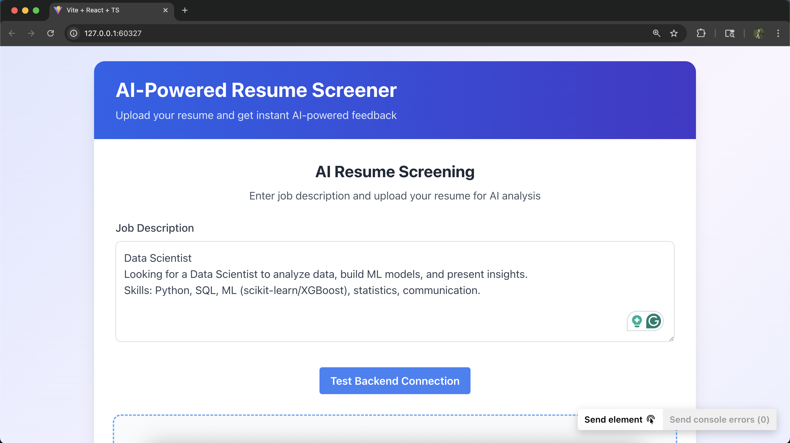
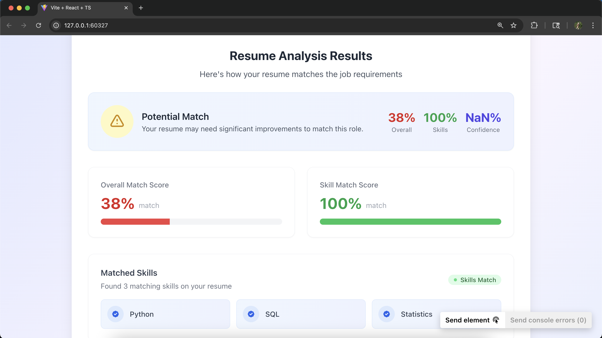
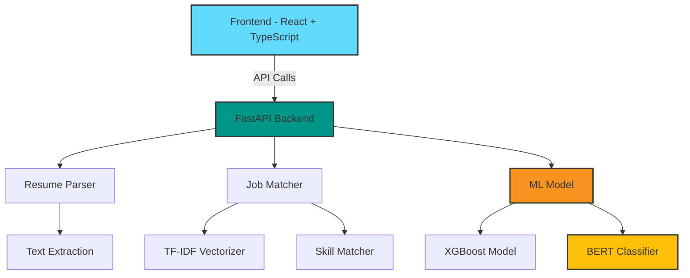

<div align="center">

# 🔍 AI Resume Screener

[](https://fastapi.tiangolo.com/)
[](https://reactjs.org/)
[](https://www.typescriptlang.org/)
[](https://tailwindcss.com/)
[](https://www.python.org/)
[](https://scikit-learn.org/)
[](https://vitejs.dev/)

[](https://opensource.org/licenses/MIT)
[](https://app.netlify.com/sites/ai-resume-screener/deploys)

A modern, **AI-powered resume screening tool** that instantly analyzes how well a resume matches a job description using state-of-the-art NLP, BERT embeddings, and machine learning — all wrapped in a beautiful, responsive UI.

[Live Demo](https://ai-resume-screener.windsurf.build) • [Report Bug](https://github.com/your-username/ai-resume-screener/issues) • [Request Feature](https://github.com/your-username/ai-resume-screener/issues)

</div>

## ✨ Features

<div align="center">
  
</div>

### 🤖 AI & Machine Learning
- **BERT Embeddings** for semantic text understanding
- **XGBoost Model** for candidate suitability prediction
- **TF-IDF & Cosine Similarity** for precise matching
- **spaCy NLP** for advanced text processing
- **Scikit-learn** for ML pipeline management

---

## ✨ Key Features

### 🔬 AI & NLP Analysis

* 💡 **Job Description Input** — Type or paste directly in the UI
* 📄 **Resume Upload** — Supports `.pdf` and `.docx`
* 🔍 **Text Extraction** — Accurate parsing of complex resumes
* 📊 **Match Score** — TF-IDF + Cosine similarity (0–100%)
* 🎯 **Skill Match %** — Compares required vs. detected skills
* 🤖 **XGBoost Prediction** — "Suitable" or "Not Suitable"
* 🧠 **BERT Relevance** — Classifies resumes with confidence score

### 💻 Modern Frontend

<div align="center">
  
</div>

* 🎨 **React + TypeScript** - For robust, type-safe components
* 🌈 **TailwindCSS + Framer Motion** - Beautiful, fluid animations
* ⚡ **Vite** - Lightning-fast build tooling
* 📥 **React Dropzone** - Drag & drop file uploads
* 📊 **Dynamic Charts** - Real-time data visualization

---

## 🚀 [Live Demo](https://ai-resume-screener.windsurf.build)

> ✅ Paste job description
> ✅ Upload resume
> ✅ View results — instantly

---

## 📈 Analysis Results

<div align="center">
  
</div>

The AI-powered analysis provides comprehensive insights:

* 🎯 **Overall Match Score** - TF-IDF based semantic similarity
* 📉 **Skill Match Score** - Required vs detected skills comparison
* 🤖 **ML Prediction** - XGBoost-powered suitability analysis
* 🧠 **BERT Classification** - Deep learning relevance scoring
* 📊 **Visual Analytics** - Clear, actionable insights

## 📚 Project Architecture



### 🎯 Core Technologies

🔍 **Frontend Stack**
- React 18 with TypeScript
- TailwindCSS for styling
- Framer Motion animations
- Vite for development

🔧 **Backend Stack**
- FastAPI for high-performance API
- Scikit-learn for ML pipeline
- BERT for deep learning
- spaCy for NLP tasks

---

## 📁 Project Structure

```
ai-resume-screener/
├── backend/
│   ├── main.py            # FastAPI routes
│   ├── job_matcher.py     # TF-IDF & skill matching
│   ├── ml_model.py        # XGBoost prediction logic
│   ├── resume_parser.py   # Text extraction
│   └── requirements.txt   # Python dependencies
│
├── frontend/
│   ├── src/
│   │   ├── components/     # React components
│   │   ├── App.tsx         # Main component
│   │   └── ...             # Other files
│   ├── public/             # Static assets
│   └── package.json
└── uploads/                # Uploaded resumes
```

---

## ⚙️ Local Setup

### 🧠 Backend (FastAPI)

```bash
git clone https://github.com/your-username/ai-resume-screener.git
cd ai-resume-screener/backend

python -m venv venv
source venv/bin/activate  # Windows: venv\Scripts\activate

pip install -r requirements.txt
python -m spacy download en_core_web_sm

uvicorn main:app --reload
```

Backend runs at: `http://localhost:8000`

---

### 💻 Frontend (React + Vite)

```bash
cd ../frontend
npm install
npm run dev
```

Frontend runs at: `http://localhost:5173`

---

## 📸 Screenshots

| Job Description Input        | Resume Upload               | Match Results                |
| ---------------------------- | --------------------------- | ---------------------------- |
|  |  |  |

---

## 📈 What’s Next?

* [ ] 🔐 User profiles & login
* [ ] 💾 Resume history tracking
* [ ] 📊 Compare against multiple job descriptions
* [ ] 📋 Resume improvement tips
* [ ] 📥 Export analysis as PDF report

---

## 🤝 How to Contribute

```bash
# Fork the repository
# Create a branch: git checkout -b feature/my-feature
# Commit your changes: git commit -m 'Add new feature'
# Push: git push origin feature/my-feature
# Open a Pull Request 🚀
```

---

## 📄 License

MIT License — See [`LICENSE`](LICENSE) for full details.

---

## 🙏 Acknowledgments

Built with ❤️ to help job seekers understand their fit — instantly.
Thanks to open-source tools and frameworks that made this project possible.

