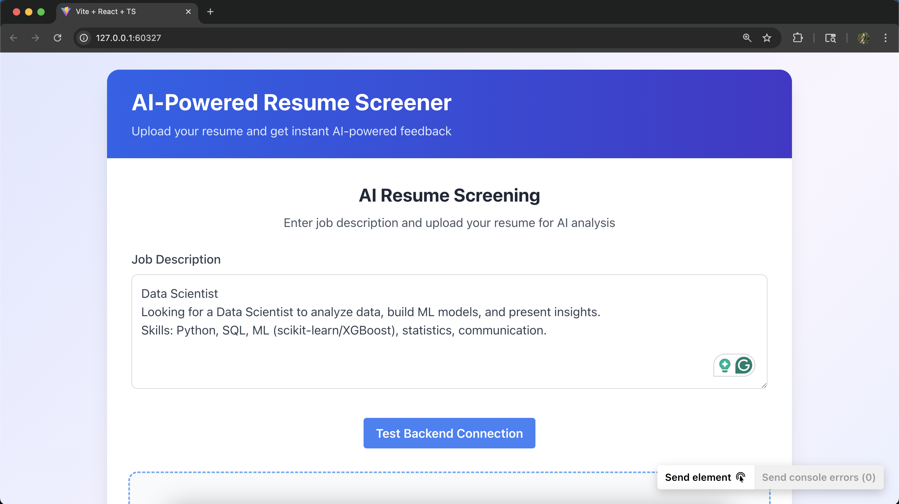
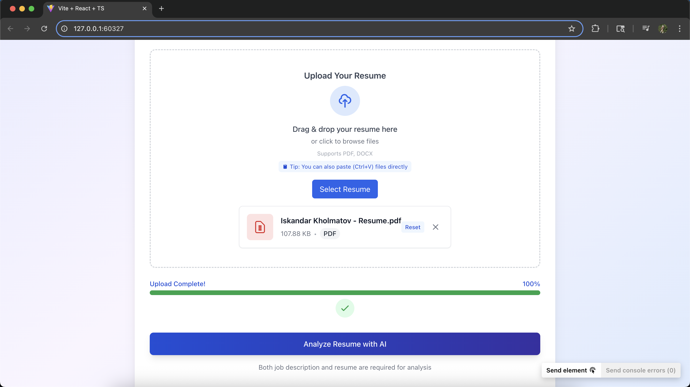
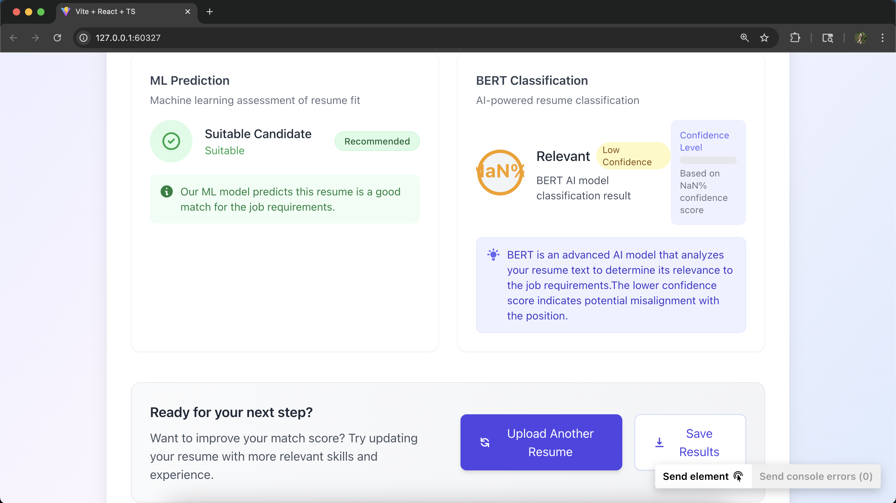

# 🔍 AI Resume Screener

[](https://app.netlify.com/sites/ai-resume-screener/deploys)
[](https://opensource.org/licenses/MIT)

A modern, **AI-powered resume screening tool** that instantly analyzes how well a resume matches a job description using NLP, BERT, and machine learning — all wrapped in a beautiful animated UI.

> 🎯 **Paste a job description → Upload your resume → Get instant, visual feedback on your fit.**

---

## ✨ Key Features

### 🔬 AI & NLP Analysis

* 💡 **Job Description Input** — Type or paste directly in the UI
* 📄 **Resume Upload** — Supports `.pdf` and `.docx`
* 🔍 **Text Extraction** — Accurate parsing of complex resumes
* 📊 **Match Score** — TF-IDF + Cosine similarity (0–100%)
* 🎯 **Skill Match %** — Compares required vs. detected skills
* 🤖 **XGBoost Prediction** — "Suitable" or "Not Suitable"
* 🧠 **BERT Relevance** — Classifies resumes with confidence score

### 💻 Frontend Experience

* 🎨 **Clean, responsive design** — Mobile-first and desktop-friendly
* ⚡ **Framer Motion animations** — For a modern, polished feel
* 📥 **Drag & drop upload** — With validation & loading indicators
* 📈 **Visual result dashboard** — Real-time, animated feedback

---

## 🚀 [Live Demo](https://ai-resume-screener.windsurf.build)

> ✅ Paste job description
> ✅ Upload resume
> ✅ View results — instantly

---

## 🛠 Tech Stack

### 🔧 Frontend

* **React** (with Vite)
* **Tailwind CSS**
* **Framer Motion** for animations
* **React Dropzone** for uploads

### 🧪 Backend

* **FastAPI** (Python)
* **pdfplumber**, **python-docx** for parsing
* **spaCy**, **transformers**, **sentence-transformers**
* **scikit-learn**, **XGBoost**, **pandas**

---

## 📁 Project Structure

```
ai-resume-screener/
├── backend/
│   ├── main.py            # FastAPI routes
│   ├── job_matcher.py     # TF-IDF & skill matching
│   ├── ml_model.py        # XGBoost prediction logic
│   ├── resume_parser.py   # Text extraction
│   └── requirements.txt   # Python dependencies
│
├── frontend/
│   ├── src/
│   │   ├── components/     # React components
│   │   ├── App.tsx         # Main component
│   │   └── ...             # Other files
│   ├── public/             # Static assets
│   └── package.json
└── uploads/                # Uploaded resumes
```

---

## ⚙️ Local Setup

### 🧠 Backend (FastAPI)

```bash
git clone https://github.com/your-username/ai-resume-screener.git
cd ai-resume-screener/backend

python -m venv venv
source venv/bin/activate  # Windows: venv\Scripts\activate

pip install -r requirements.txt
python -m spacy download en_core_web_sm

uvicorn main:app --reload
```

Backend runs at: `http://localhost:8000`

---

### 💻 Frontend (React + Vite)

```bash
cd ../frontend
npm install
npm run dev
```

Frontend runs at: `http://localhost:5173`

---

## 📸 Screenshots

| Job Description Input        | Resume Upload               | Match Results                |
| ---------------------------- | --------------------------- | ---------------------------- |
|  |  |  |

---

## 📈 What’s Next?

* [ ] 🔐 User profiles & login
* [ ] 💾 Resume history tracking
* [ ] 📊 Compare against multiple job descriptions
* [ ] 📋 Resume improvement tips
* [ ] 📥 Export analysis as PDF report

---

## 🤝 How to Contribute

```bash
# Fork the repository
# Create a branch: git checkout -b feature/my-feature
# Commit your changes: git commit -m 'Add new feature'
# Push: git push origin feature/my-feature
# Open a Pull Request 🚀
```

---

## 📄 License

MIT License — See [`LICENSE`](LICENSE) for full details.

---

## 🙏 Acknowledgments

Built with ❤️ to help job seekers understand their fit — instantly.
Thanks to open-source tools and frameworks that made this project possible.

